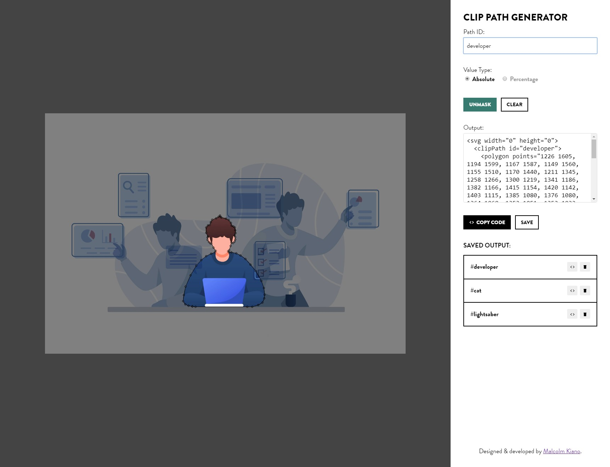

# Clip Path Generator
✒ A handy tool to help you trace out clip-paths from your images.  
🚀 Live now at https://malcolmkiano.github.io/clip-path-generator

## Screenshots

## Features
- Complete:
  - [x] Clip path tracing with visual feedback
  - [x] Image masking using created clip path
  - [x] Image and path persistence using `localStorage`
  - [x] Generating points in absolute/percentage mode
  - [x] Output inline SVG generation
  - [x] Copying code to clipboard
  - [x] Saving output code for later use

- To do:
  - [ ] Zoom in/out of workspace
  - [ ] Point editing
  - [ ] Moving entire path
  - [ ] Undoing points
  - [ ] Default file upload style (other than drag and drop)
  - [ ] Clearing the workspace
  - [ ] Applying saved paths to different images
  - [ ] Output CSS generation _(SVG was originally used exclusively since more browsers support it)_
  - [ ] Lasso tracing of images for more complex shapes
  - [ ] Keyboard shortcuts & triggers

## Contribute
Have any cool ideas for improvements on the functionality of this app? Want to help out with the development? Feel free to make a pull request. 😊 